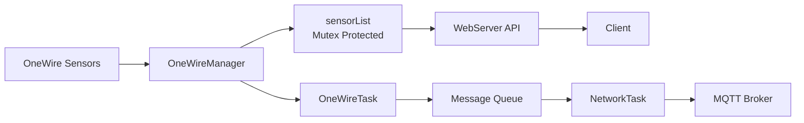
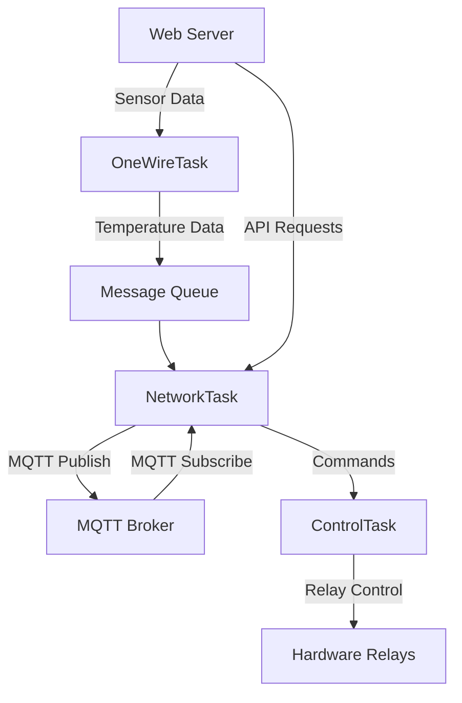

# SensorHub: A Resilient Multi device One-Wire ESP32 Platform for Temperature Monitoring and Control

Designed for multiple One-wire sensors on a single One-wire bus.
Resistant to a changing number of sensors on the bus. 
Robust design based on FreeRTOs and Watchdog guards. 
Publishes data to an embedded Web server and simultaneously to an MQTT broker.
Relay control via MQTT messaging and via embedded web server. 
Also features a 7-segement display.

The application runs on an embedded device, providing:
	•	Real-time temperature readings from OneWire sensors.
	•	A web server with endpoints for sensor data, relays, and system status.
	•	Thread-safe access to sensor data using FreeRTOS mutexes.
	•	Static file serving for potential front-end integration.
	•	Dynamic sensor array: 1-wire bus is frequently scanned for added or lost 1-wire devices.

## Key Features

- **Real-Time Monitoring and Control**:
  - Collects and processes data from multiple DS18B20 temperature sensors on a single OneWire bus.
  - Provides relay control via MQTT messages or a web interface.
  
- **Thread-Safe and Dynamic**:
  - Uses FreeRTOS mutexes for secure, concurrent access to sensor data.
  - Dynamically detects sensors added to or removed from the bus.

- **Web and MQTT Integration**:
  - Hosts a non-blocking web server for data and control endpoints.
  - Publishes sensor data and receives commands via MQTT.

- **Robust Design**:
  - Built with FreeRTOS and Watchdog guards for reliability.
  - Logs critical events like mutex failures and invalid sensor data.


## Architecture Overview

### Web Server (WebServer.cpp)
- Serves static files and manages API endpoints:
  - `/api/sensors`: Lists sensors and temperature readings.
  - `/api/relays`: Controls and reports relay status.
  - `/api/status`: Returns system health and diagnostics.

- Built on AsyncTCP and AsyncWebServer libraries for efficient, non-blocking I/O.

### OneWire Manager (OneWireManager.cpp)
- Manages DS18B20 temperature sensors:
  - Scans, maintains, and updates a dynamic sensor list.
  - Provides thread-safe access to sensor data using FreeRTOS mutexes.
- Exposes API methods like `getSensorList()` for other modules.

### Code Structure

The project is organized into the following files and directories:

```
Project Structure
├── src/                            # Source files
│   ├── main.cpp                    # System entry point and initialization
│   ├── NetworkTask.cpp             # Network and MQTT communication management
│   ├── OneWireTask.cpp             # Temperature sensor scanning and reading task
│   ├── ControlTask.cpp             # System control, relay, and display management
│   ├── WebServer.cpp               # Web server and REST API implementation
│   ├── MqttManager.cpp             # MQTT communication and messaging
│   ├── OneWireManager.cpp          # Low-level OneWire sensor bus management
│   ├── PreferencesManager.cpp      # System preferences and persistent storage
│   ├── PreferencesApiHandler.cpp   # API handler for preferences management
│   ├── SystemHealth.cpp            # System monitoring and diagnostic tracking
│   ├── DisplayManager.cpp          # 7-segment display driver and control
│   └── Logger.cpp                  # Centralized logging system
│
├── include/                        # Header files
│   ├── Config.h                    # System-wide configuration and constants
│   ├── SystemTypes.h               # Core data structures and type definitions
│   ├── NetworkTask.h               # Network task interface
│   ├── OneWireTask.h               # OneWire task interface
│   ├── ControlTask.h               # Control task interface
│   ├── WebServer.h                 # Web server class definition
│   ├── MqttManager.h               # MQTT management interface
│   ├── OneWireManager.h            # OneWire bus management interface
│   ├── PreferencesManager.h        # Preferences management interface
│   ├── PreferencesApiHandler.h     # Preferences API handler
│   ├── DisplayManager.h            # Display management interface
│   ├── SystemHealth.h              # System health tracking interface
│   ├── Logger.h                    # Logging system interface
│   ├── ESP32PreferenceStorage.h    # Platform-specific preferences storage
│   ├── PreferenceStorage.h         # Abstract preferences storage interface
│   ├── SharedDefinitions.h         # Shared constant and configuration definitions
│   ├── SystemTypes.h               # Shared type definitions
│   ├── certificates.h              # SSL/TLS certificates
│   └── esp_task_wdt.h              # Watchdog timer configuration
│
├── data/                           # SPIFFS web interface files
│   ├── index.html                  # Main dashboard
│   └── preferences.html            # System preferences configuration page
│
├── lib/                            # Third-party libraries
│   └── (library dependencies)
│
├── test/                           # Unit and integration tests (future expansion)
│
├── platformio.ini                  # PlatformIO project configuration
├── README.md                       # Project documentation
└── LICENSE                         # Project licensing information
```

# Data Flow

1. Sensor Data Collection
	•	The OneWireManager scans for connected sensors using sensors.getDeviceCount() and sensors.getAddress().
	•	Temperature readings are requested using sensors.requestTemperaturesByAddress() and read via sensors.getTempC().
	•	The sensor list and readings are stored in a thread-safe data structure (sensorList), guarded by a FreeRTOS mutex.

2. API Requests
	•	A client sends an HTTP GET request to an API endpoint (e.g., /api/sensors).
	•	The web server calls the getSensorList() method from OneWireManager.
	•	Sensor data is serialized into JSON using ArduinoJson and sent back to the client.

3. Static File Serving
	•	The root path (/) serves static files (e.g., a front-end dashboard) from the SPIFFS filesystem.

### Data Flow Diagram

The following diagram illustrates how data moves through the system, from sensors to the web server and MQTT broker:


## Core Components

1. **Task System**
   - `NetworkTask`: Handles MQTT communication and network connectivity
   - `OneWireTask`: Manages temperature sensor readings
   - `ControlTask`: Handles relay control and system logic

2. **Managers**
   - `OneWireManager`: Interfaces with DS18B20 temperature sensors
   - `PreferencesManager`: Handles persistent settings storage
   - `SystemHealth`: Monitors system metrics and health

3. **Communication**
   - MQTT for external communication
   - Internal message queues between tasks
   - Web server for configuration and monitoring

### Data Flow


## Setup

1. **Hardware Requirements**:
   - ESP32 microcontroller with a OneWire-compatible pin.
     The Olimex ESP32 EVB board is a perfect solution, pin4 of the UEXT connector can be used for OneWire.
   - DS18B20 temperature sensors on a OneWire bus.
   - Pull-up resistor for proper operation.

2. **Software Requirements**:
   - Arduino IDE or PlatformIO.
   - Libraries:
     - AsyncTCP
     - ESPAsyncWebServer
     - ArduinoJson

3. **Configuration**:
   - Update `Config.h` with the correct pin numbers and timeouts.

4. **Deployment**:
   - Flash the firmware to the device.
   - Access the web interface via the device's IP address.

## Troubleshooting

### No Sensors Detected
- Verify sensors are correctly connected to the OneWire bus.
- Ensure the pull-up resistor is properly installed.

### API Returns 0 Sensors
- Check logs for errors like "Failed to take mutex."
- Increase the mutex timeout in `OneWireManager.cpp`.

### `_poll(): pcb is NULL`
- Ensure connections are properly closed after handling requests.
- Reduce the number of simultaneous client connections.

### Debugging Tips
- Enable verbose logging in the Logger module.
- Monitor system load and network traffic to identify bottlenecks.

## Future Improvements
	•	Implement asynchronous temperature conversion to reduce blocking.
	•	Add support for additional sensor types.
	•	Optimize memory usage for larger sensor arrays.

## License

BSD 3-Clause License (Modified)